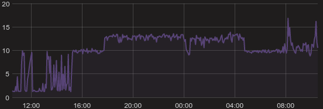
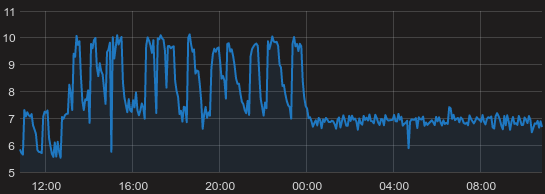

## On Learners

* extraTrees does "unasked parallelization" (cpu usage of 10, then )? Could be a caret, docker, java  problem. But did not occur for mlr jobs.


* blackboost has overall low performance and was dropped from the experiments
* gbm often produces NaN results for higher shrinkage values and was dropped from the experiments
* Also xgbTree is very slow with caret

## On Datasets

* 

## On Cartet

This script helps to crash stalled stalled containers (somehow), while others will stay running.
```r
job.hash.running = getJobTable()[findRunning()]$job.hash
for(jh in job.hash.running) {
  did = system(sprintf('docker ps -q --filter "name=richter_bt_%s"', jh))
  system(sprintf('docker attach %s', did))
}
```

## On mlr